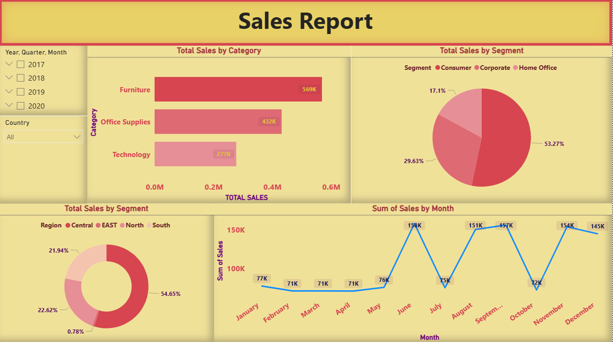

# Global Sales Dashboard | Power BI
## Project Overview

This project presents an interactive Power BI dashboard built using global retail sales data. The dashboard analyzes sales performance, customer segments, product categories, and monthly trends to generate business insights.

Tools & Technologies
Power BI
Power Query
DAX
Excel
Dataset Features

The dataset includes:

Sales
Profit
Quantity
Customer details
Product categories
Regional information
Order status
Shipping modes
Manager performance

Dataset fields include Order_ID, Sales, Profit, Segment, Region, Category, Product_Name, and more.

Dashboard Features
Sales by Category Analysis
Customer Segment Analysis
Monthly Sales Trend
Interactive Filters & Slicers
Regional Insights
KPI Reporting
Key Insights
Consumer segment generated highest sales contribution
Furniture category showed strong overall sales
Monthly sales trends revealed seasonal fluctuations
Regional segmentation improved business understanding

## Dashboard Preview

